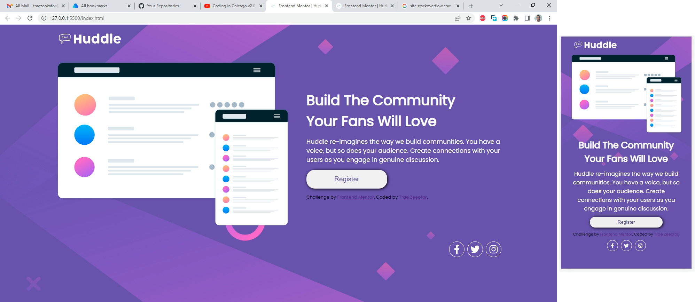

# Frontend Mentor - Huddle landing page with single introductory section solution

This is a solution to the [Huddle landing page with single introductory section challenge on Frontend Mentor](https://www.frontendmentor.io/challenges/huddle-landing-page-with-a-single-introductory-section-B_2Wvxgi0). Frontend Mentor challenges help you improve your coding skills by building realistic projects. 

## Table of contents

- [Overview](#overview)
  - [The challenge](#the-challenge)
  - [Screenshot](#screenshot)
  - [Links](#links)
- [My process](#my-process)
  - [Built with](#built-with)
  - [What I learned](#what-i-learned)
  - [Continued development](#continued-development)
  - [Useful resources](#useful-resources)
- [Author](#author)
- [Acknowledgments](#acknowledgments)

## Overview

### The challenge

Users should be able to:

- View the optimal layout for the page depending on their device's screen size
- See hover states for all interactive elements on the page

### Screenshot

### Links

- Solution URL: [https://github.com/traez/huddle-landing-page-with-single-introductory-section-master](https://github.com/traez/huddle-landing-page-with-single-introductory-section-master)
- Live Site URL: [https://traez.github.io/huddle-landing-page-with-single-introductory-section-master/](https://traez.github.io/huddle-landing-page-with-single-introductory-section-master/)

## My process

### Built with

- Semantic HTML5 markup
- CSS custom properties
- Flexbox
- CSS Grid
- Mobile-first workflow

### What I learned

1) Getting more familiar implementing multiple backgrounds  
2) How to pay attention/build for specified width  
3) Enabling responsive using aspect-ratio and sub-container width  
4) Used gap property to manipulate spacing in Flexbox  
5) Using grid-template-areas to eliminate the mathematics of grid-areas  

### Continued development

1) Forgot to implement "hover states". My apologies.  
2) Having done 11 CSS-HTML projects, I feel comfortable manipulating CSS usefully.  
Truly I was barely scratching the surface previously.  
Now time to move on to Javascript review and projects.  

### Useful resources

Stackoverflow, MDN Web Docs, YouTube, Google 

## Author

- Website - [Trae Zeeofor](https://github.com/traez)  
- Frontend Mentor - [@traez](https://www.frontendmentor.io/profile/traez)  
- Twitter - [@trae_z](https://twitter.com/trae_z) 

## Acknowledgments

Thanks to the Super Falconets for a great start to their FIFA U20 WorldCup campaign
